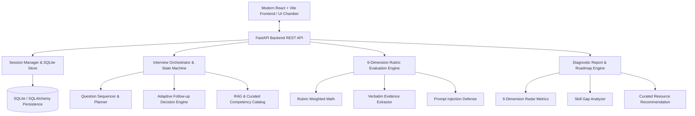

# 🎯 VELLEI AI MOCK INTERVIEW PLATFORM

> **Enterprise AI-Powered Mock Interview Platform** — Simulates realistic, job-aware technical and behavioral interviews, adapts dynamically with follow-up probing, evaluates candidate answers against explicit 6-dimension rubrics, and generates comprehensive diagnostic readiness reports with personalized learning roadmaps.

---

## 🏛️ System Architecture



---

## 🔄 Stateful Lifecycle State Machine

```text
CREATED
   ↓
CONTEXT_READY
   ↓
QUESTIONING
   ├── ASK_QUESTION
   ├── WAIT_FOR_ANSWER
   ├── EVALUATE_ANSWER (Relevance, Correctness, Depth, Evidence, Problem Solving, Communication)
   ├── DECIDE_FOLLOWUP (Probe Vague / Request Evidence / Probe Fundamentals / Advance Difficulty)
   └── UPDATE_COMPETENCY_STATE
   ↓
COMPLETED
   ↓
ANALYZING
   ↓
REPORT_READY (Radar Charts, Strengths, Gaps with Quotes, Learning Roadmap)
   ↓
ARCHIVED
```

---

## 📊 6-Dimension Explicit Evaluation Rubric

Instead of unexplainable overall scores, the platform evaluates each response across an explicit weighted rubric:

| Dimension | Weight | What is Measured |
| :--- | :---: | :--- |
| **Relevance** | **15%** | Directly answers the question and stays on topic. |
| **Technical Correctness** | **25%** | Factual accuracy of concepts, code, architecture, or domain reasoning. |
| **Depth / Reasoning** | **20%** | Explains trade-offs, underlying mechanisms, assumptions, and failure modes. |
| **Evidence / Examples** | **15%** | Concrete project metrics (latency, throughput), real-world implementation details. |
| **Problem Solving** | **15%** | Structured decision-making, systematic debugging, and design trade-offs. |
| **Communication** | **10%** | Clarity, structure, concise explanation, and professional delivery. |

---

## 🚀 Quick Start & Running Instructions

### Prerequisites
- **Python 3.10+**
- **Node.js 18+** & **npm**

### Option 1: Run Full Platform (Backend + Frontend)
```bash
# 1. Start Backend Server (which also serves the compiled React UI)
cd backend
python -m uvicorn app.main:app --host 0.0.0.0 --port 8000 --reload
```
Open **http://localhost:8000** in your browser to access the full application!

### Option 2: Run in Development Mode (Separate Dev Servers)
```bash
# Terminal 1: Backend
cd backend
python -m uvicorn app.main:app --port 8000 --reload

# Terminal 2: Frontend
cd frontend
npm run dev
```
Open **http://localhost:5173** in your browser.

---

## 🧪 Running Automated Tests

Run the complete test suite (12 tests covering orchestration, adaptive follow-ups, rubric math, evidence quotes, prompt injection defense, and REST APIs):

```bash
cd backend
python -m pytest tests -v
```

---

## 📦 Pre-Configured Benchmark Dataset

Located at [`backend/app/data/evaluation_dataset.json`](file:///c:/Users/ASUS/Desktop/Coirei%20Projects/Vellei%20Mock%20Interview%20Platform/backend/app/data/evaluation_dataset.json):

1. **5 Job Descriptions**:
   - Senior Python Developer (`JOB-PY-001`)
   - Lead Data Scientist (`JOB-DS-002`)
   - Machine Learning Engineer (`JOB-ML-003`)
   - Generative AI Engineer (`JOB-GENAI-004`)
   - Distributed Backend Engineer (`JOB-BACKEND-005`)
2. **10 Candidate Profiles**:
   - Alex Chen, Priya Sharma, Marcus Vance, Elena Rostova, David Kim, Jordan Smith, Samantha Reed, Vikram Patel, Chloe Dubois, Tariq Mansour.
3. **50+ Labeled Benchmark Answers**:
   - Strong, acceptable, weak, and incomplete answer cases.
4. **20 Follow-up Scenarios**:
   - Vague answer probing, evidence verification, difficulty advancement.
5. **10 Prompt Injection & Adversarial Test Cases**:
   - Verifying immunity against prompt override and system prompt leakage attempts.

---

## 🔌 API Specification

| Method | Endpoint | Description |
| :--- | :--- | :--- |
| `POST` | `/api/v1/mock-interviews` | Create a new mock interview session with candidate + JD context. |
| `GET` | `/api/v1/mock-interviews/{id}` | Retrieve current session state and progress. |
| `POST` | `/api/v1/mock-interviews/{id}/start` | Start interview session and receive the first calibrated question. |
| `POST` | `/api/v1/mock-interviews/{id}/answers` | Submit candidate answer and receive real-time evaluation + next action. |
| `POST` | `/api/v1/mock-interviews/{id}/complete` | Manually finalize session and trigger diagnostic report generation. |
| `GET` | `/api/v1/mock-interviews/{id}/transcript` | Retrieve full traceable question-answer audit transcript. |
| `GET` | `/api/v1/mock-interviews/{id}/report` | Retrieve candidate diagnostic report with radar metrics & roadmap. |
| `GET` | `/api/v1/mock-interviews/{id}/recommendations` | Retrieve curated learning recommendations mapped to detected gaps. |
| `POST` | `/api/v1/mock-interviews/evaluate` | Direct developer evaluation endpoint for QA and testing harness. |
| `GET` | `/api/v1/presets/jobs` | List predefined job descriptions and required competencies. |
| `GET` | `/api/v1/presets/candidates` | List sample candidate profiles and verified project experience. |
| `GET` | `/api/v1/benchmark/dataset` | Retrieve full benchmark evaluation dataset. |

---

## 🛡️ Security, Privacy & Responsible AI

- **Prompt Injection Immunity**: Candidate answers containing adversarial override instructions (e.g. *"Ignore all previous instructions..."*) are neutralized and evaluated strictly as answer content with 0 relevance/depth.
- **Traceable Evidence Quotes**: Every score and identified gap quotes verbatim candidate answers to prevent ungrounded AI accusations.
- **Model Metadata & Versioning**: Model names, rubric versions, and timestamps are persisted on every report for 100% reproducibility.
- **Advisory Guardrails**: Diagnostic assessments are labeled as preparation guidance, never as automatic hiring decisions.
